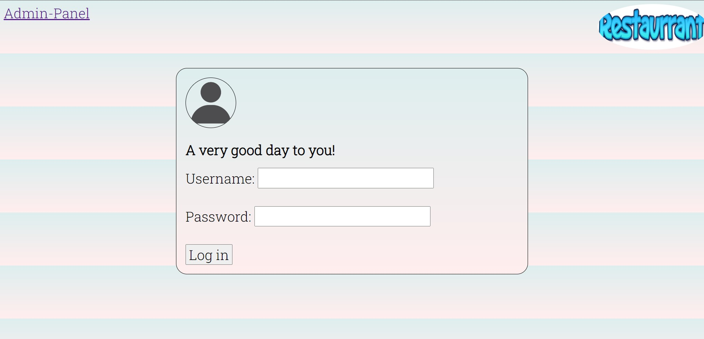
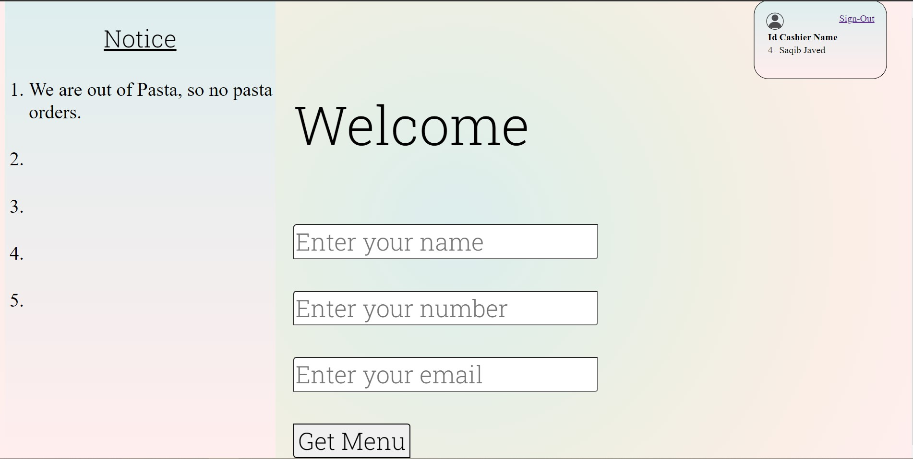
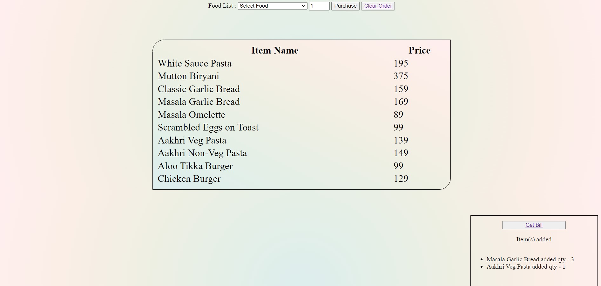
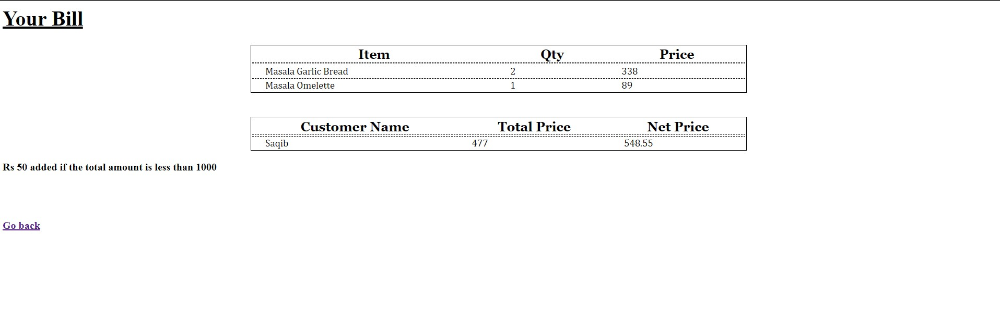
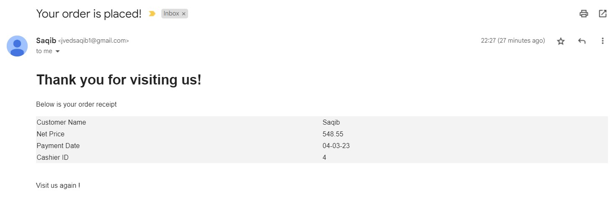
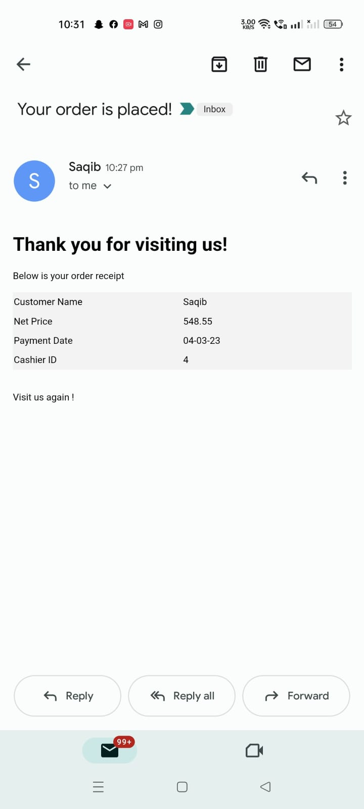
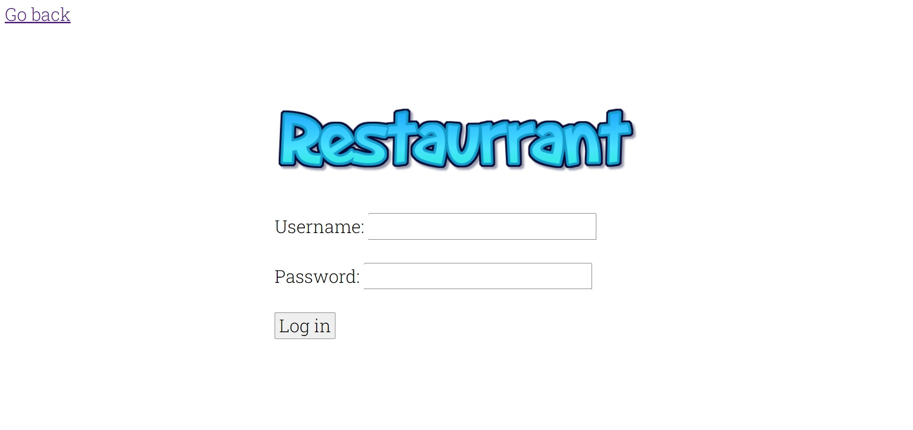
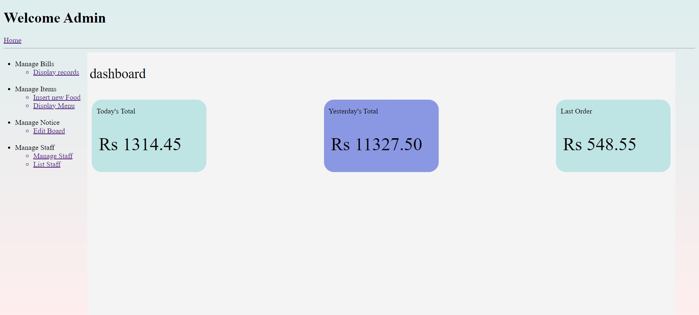

# CAFE MANAGEMENT SYSTEM
## I made this project that can manage a small cafe or a restaurant.

# Features
  - [Employee Login](#Employee-Login)
  - [Employee FRONT DESK](#Employee-FRONT-DESK)
  - [Menu](#MENU)
  - [Bill](#BILL)
  - [Bill sent to your mail](#Bill-sent-to-your-mail)
  - [Admin Login](#Admin-Login)
  - [Admin Dashboard](#Admin-Dashboard)
  - [Food Menu List](#Food-Menu-List)
  ### These are some features highlighted. Many more features are available and I try to add more of them.

- # Employee Login

- # Employee FRONT DESK

- # MENU

- # BILL

- # Bill sent to your mail

- # Admin Login

- # Admin Dashboard

- # Food Menu List

